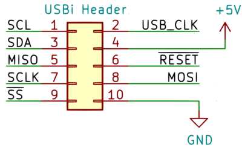
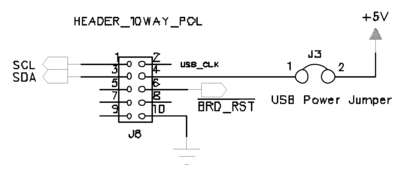

# Hardware Connections

## USBi Connector

All SigmaDSP evaluation boards are outfitted with a 10-pin connector for programming. The connector mates with a USBi programmer (included with all evaluation boards) using the pinout shown here. The USBi connector is also the best way to connect a microcontroller to your evaluation board.

USB_CLK is not a required signal for SigmaDSP development boards, so it is usually left as an open circuit.

Please reference the schematics for your evaluation board's User Guide, which can be found on its product webpage, to determine which interfaces are exposed on connectors. Also note whether your evaluation board includes pull-up resistors on the SCL, SDA, and /SS pins; if they are not present, you must add them.

## ADAU1701

The EVAL-ADAU1701MINIZ schematic shows that only I2C is available on the programming header (pins 1 and 3). Additionally, there are no I2C pull-up resistors shown in the schematic so they must be provided by your own hardware. The header also includes a reset pin (pin 6) and 5V power pin (pin 4). In the example code ADAU1701 is referred to as a “Sigma100” processor.

The evaluation board uses 3.3V logic levels. Level shifters are recommended for interfacing with 1.8V or 5V microcontrollers.

The 5V power pin (Pin 4) can be connected to your microcontroller's VUSB pin if sufficient current is available. Be careful not to exceed 500mA total current draw from a USB port.

